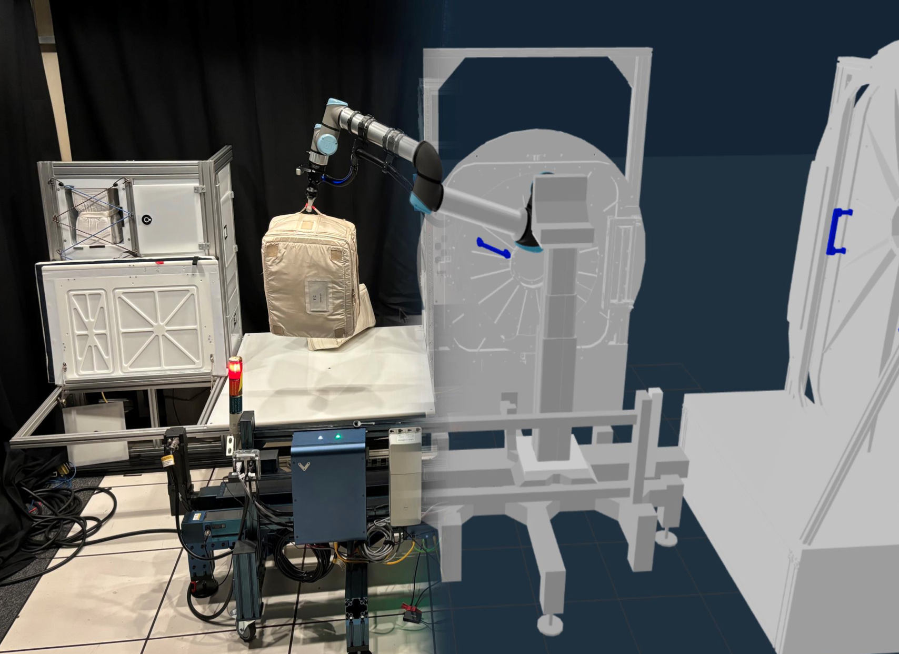

# ChonkUR L Rail-E Workspace

This workspace includes open source resources for using the ChonkUR L Rail-E robot system,
part of the [iMETRO Facility](https://ntrs.nasa.gov/citations/20240013956) at NASA's Johnson Space Center.

The system consists of a UR10e robot mounted on top of an Ewellix column lift and Vention rail.
Peripherals include a Robotiq Hand-E gripper with custom printed fingers and a wrist mounted Realsense D435 camera.
Descriptions of commonly used environmental components are also included, such as hatches, storage benches, or Merlin Freezes.
The mock-ups here can be used by anyone to develop or test robot applications for space logistics in our hardware environment.



This workspace bundles all required git submodules into a Docker containerized workflow that is identical to that which we run on hardware.
While not required, we recommend using our Dockerfiles for consistent environment setup.
Alternatively, individual description and deploy submodules can be combined as needed to meet user's requirements.

## Quick Development Setup

1) [Install Docker](https://docs.docker.com/engine/install/ubuntu/)
    - Don't worry about Docker Desktop
    - For Ubuntu recommend using the [utility script](https://docs.docker.com/engine/install/ubuntu/#install-using-the-convenience-script)
2) Fork or copy the contents of this repository as needed

    ```bash
    # Clone with submodules
    git clone --recursive git@js-er-code.jsc.nasa.gov:imetro/robots/chonkur-l-rail-e/clr_ws.git

    # Or initialize them from the repo's root
    cd clr_ws
    git submodule update --init
    ```

3) Set your user information for the project build
    - We recommend just putting this in your `~/.bashrc`:

      ```bash
      export USER_UID=$(id -u $USER)
      export USER_GID=$(id -g $USER)
      ```

    - Alternatively, open the `.env` file in the root of this repo and update each line with your information
        - `USER_UID` and `USER_GID`
            - found using `id -u` and `id -g` respectively

Then follow the instructions below to build and run the application.

## Using the Development Image

Build the base images using the compose specification.

To build the development image from the repo root, and then launch it

```bash
# Compile the image
docker compose build dev

# Start it
docker compose up dev -d

# Connect to the console shell
docker compose exec dev bash
```

Once you're attached to the container, you can use it as a regular colcon workspace.
The contents of the `src/` directory will be mounted into `/home/er4-user/ws/src`.

For example:

```bash
cd ${HOME}/ws
colcon build
source install/setup.bash
```

A basic kinematic simulation with the description files, as well as a MoveIt configuration is included.
To start those applications from inside the container,

```bash
# In one terminal launch the simulated environment
ros2 launch clr_deploy control.launch.py use_fake_hardware:=true

# In another shell launch the moveit interface and move group nodes
ros2 launch clr_moveit_config clr_moveit.launch.py
```

## Using the Hardware Image

The [compose file](docker-compose.yml) includes one additional runtime target, `hw`, for running on the physical robot.
This service extends the `dev` service by adding necessary configuration for interacting with ChonkUR's hardware.
It is built and run identically to the `dev` target,

```bash
# Compile the image
docker compose build hw

# Start it
docker compose up hw -d

# Connect to the console shell
docker compose exec hw bash
```

Then use it in the same way as the development image, with the added hardware connections.

## Other Things to Note

- Build logs, compiled artifaces, and the `.ccache` are also mounted in the workspace/user home.
This ensure artifacts are persisted even when restarting or recreating the container.

- Your host's DDS configuration (either cyclone or fastrtps) will be mounted into the image if set in your environment.
For more information refer to the [compose specification](docker-compose.yaml).

- Defaults for `colcon build` are set for the user. To change or modify, refer to the [defaults file](config/colcon-defaults.yaml).
